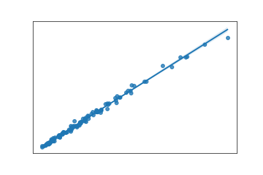
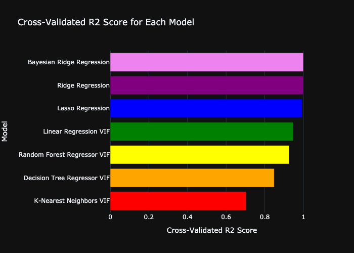

# Predict-NBA-Points-Per-Game

## Project Overview
This project scrapes, cleans, visualizes and uses machine learning to predict the points per game of players from the 2024 NBA season.  
1. Web scrape player data from [`basketball-reference.com`](https://www.basketball-reference.com). 
2. Read in and clean the html using BeautifulSoup. 
3. Parse the individual statistics into `pandas` DataFrames that will be used for both visualizations and machine learning. 
4. Select features to prevent model overfitting.
5. Train machine learning models to predict points per game. 

### Cool Techniques
1. Implemented `scikit learn` tools to predict points per game with over 99% accuracy with regularized machine learning models (`Ridge Regression`, `Lasso Regression`, and `Bayesian Ridge Regression`)  

2. Used `Variance Inflation Factor` values to perform feature selection and prevent overfitting of machine learning models, which helped achiece over 90% accurate predictions of points per game for the `Linear Regression`, `Decision Tree Regression`, and `Random Forest Regression` models

   [Final Varibales Selected with VIF threshold set to 10](./Visualizations/Variables<10VIF.csv)

3. Measured efficacy of models using four parameters `R2 Score`, `Adjusted R2 Score`, `Cross-Validated R2 Score`, and `Root Mean Squared Error` and created easily digestible visualizations of the relationships between these values between models
   

### Challenges
1. I struggled with finding the proper methods to prevent overfitting in the machine learning models. First, I experimented with and creating visualizations of changes in the `Akaike Information Criterion (AIC)` and the `Bayesian Information Criterion (BIC)` values of my `Linear Regression Model` to determine the optimal number of variables to include in the model, but the process lacked specificity, and was open to too much personal interpretation of what was a "low enough" value. Next, I tried to use `Pearson Correlation` to select specific variables to remove, but since `Pearson Correlation` only measures the correlation between two variables, this method did not work for my multivariable model. Eliminating variables until all `VIF` values were less than 10 ended up being the most accurate way to perform feature selection.
2. On [`basketball-reference.com`](https://www.basketball-reference.com), the player data lists players who were traded during the season multiple times. It lists their stats with their first team, their second team, and their total season stats. To prevent these traded players from being counted multiple times and skewing the results of visualizations and analysis, I split the data into two data sets `df_totals` (the DataFrame with the season totals), and `df_no_totals` (the DataFrame with the first and second team stats).
3. I haven't worked with machine learning techniques before, so the learning curve was steep, and I'm open to ways I can improve this project!

### What else I would have liked to do...
1. Implement a method to input values of variables used for prediction and have the machine learning models output their predicted values
2. Implement `scikit learn`'s `GridSearchCV` method to to tune the hyerparameters of my models
3. Explore more into how the regularized machine learning models like account for correlations between variables

### Code
File Overview:  
   - `get_clean_data.ipynb`: web scrapes data, cleans it, and prepares two .csv files for visualization and modeling
   - `visualize.ipynp`: creates visualizations of relationships between variables in the data
   - `model.ipynb`: creates and optimizes four different machine learning models to predict  `Points Per Game` using the data
 
<b>Reminder:</b> Make sure to change the file paths to your own in the code!

## Run this project yourself!
### 1. Local Setup  

Please install the following locally:
   - JupyterLab/JupyterNotebook
   - Python 3.8+
   - Python Packages
      - [`BeautifulSoup`](https://www.crummy.com/software/BeautifulSoup/bs4/doc/): Used for scraping html.
      - [`pandas`](https://pandas.pydata.org/docs/index.html): Used for cleaning and manipulating data.
      - [`matplotlib`](https://matplotlib.org/stable/index.html): Used for plotting and visualizing data.
      - [`plotly`](https://plotly.com/python/): Used for plotting and visualizing data.
      - [`seaborn`](https://seaborn.pydata.org): Used for visualizing correlations.
      - [`scikit learn`](https://scikit-learn.org/stable/): Used for creating maching learning models.
      - [`statsmodels`](https://www.statsmodels.org/stable/index.html): Used for `VIF` calculations.

### 2. Data  

Either use the pre-scraped data set [`here`](https://drive.google.com/drive/folders/1Ywo_Pqlyr6psnKRL9X-ettpqIKeGAV_u?usp=share_link) and start running the code form the `visualize.ipynb` onward

**OR**

Run the `get_clean_data.ipynb` to scrape and clean the data yourself!
